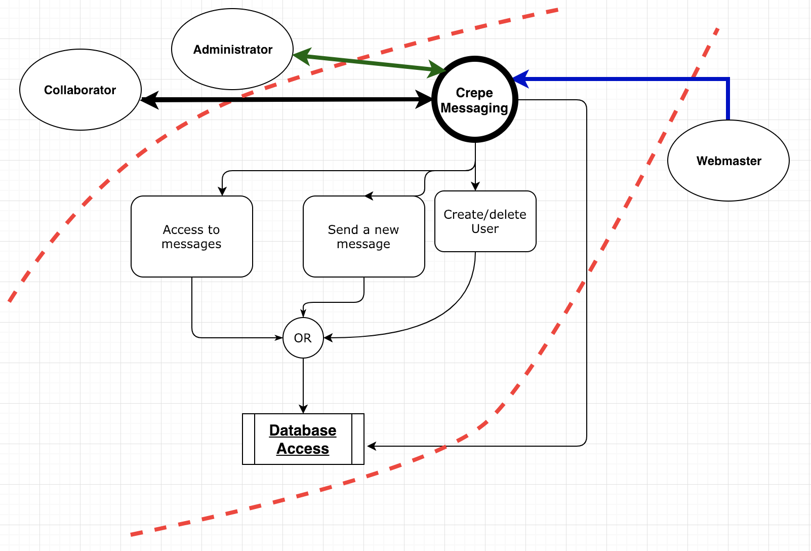
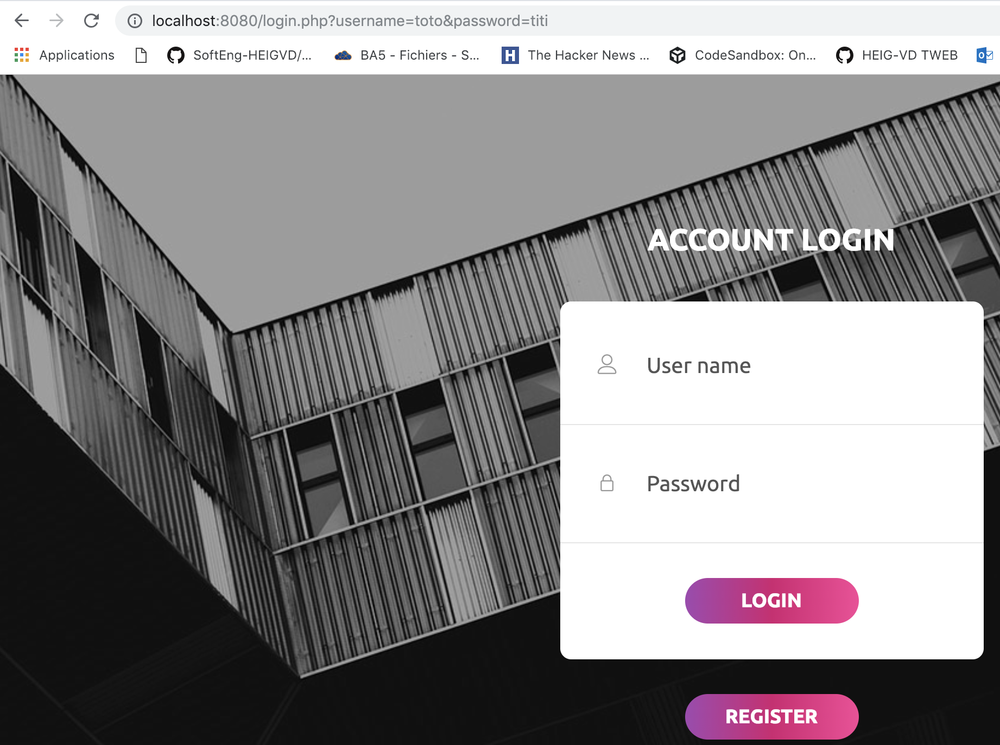
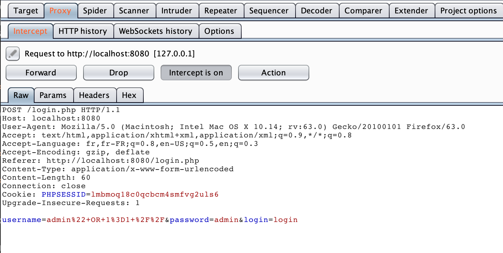
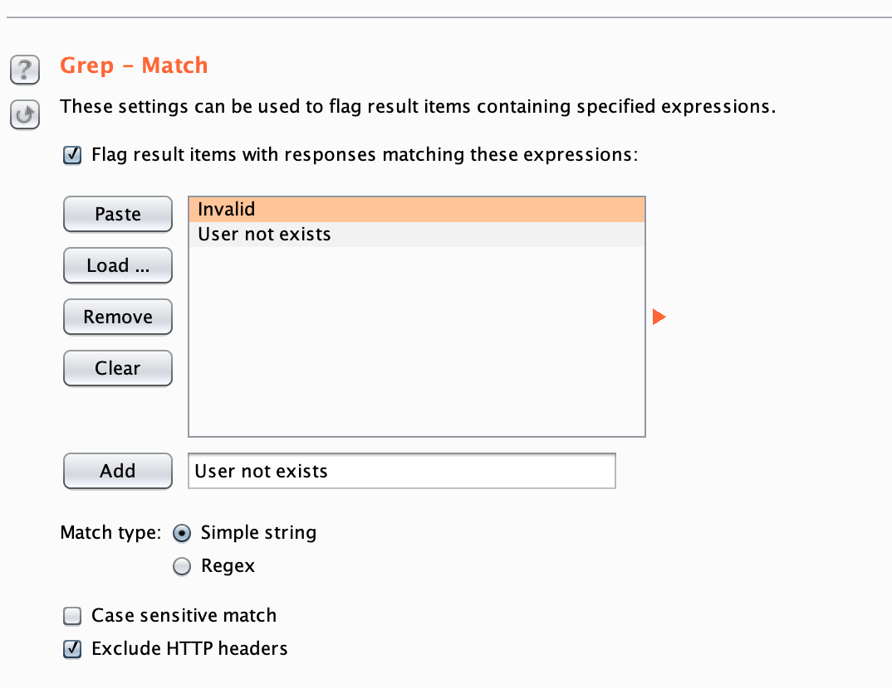
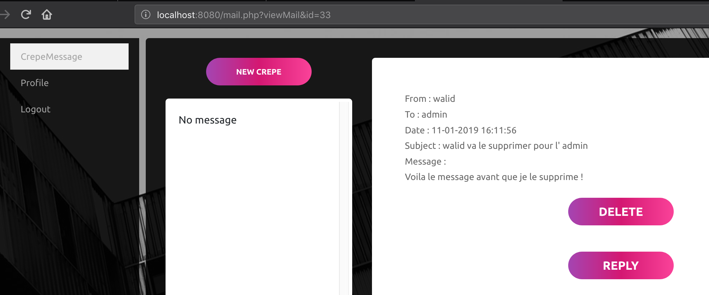
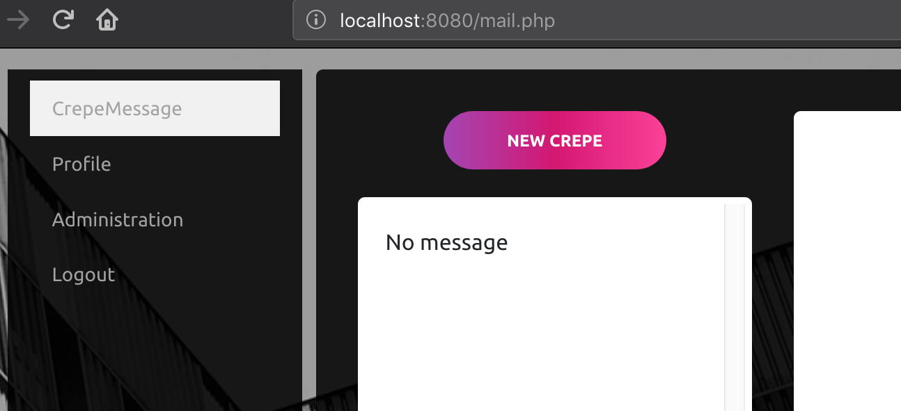

#Projet " STI" Part 2

>Authors: Koubaa Walid & Schar Joel 	
>Date: 15/01/2019

##Introduction au site web

####Crepe Messaging, c'est quoi ?

A crepe is an eatable support that can usualy be sent by throwing it like a freezbe. Using Crepe messaging allows yout to send those crepes over the internet.

##Description du système

####Data-flow diagrams 

Voici ci dessous le diagramme représentant la décomposition du système.

celui ci représente les processus, les flow et le **périmètre de sécurisation** indiquant les niveaux de sécurité du système est représenté par les pointillés rouge.

####Objectifs du système

Permettre d'envoyer des messages entre collaborateurs et permettre aux administrateur de creer de nouveaux utilisateur en lui spécifiant un role (collaborateur/administrateur).

####Hypothèses de sécurité

Nous supposons que dans notre système:

- seul un administrateur peut creer de nouveau utilisateur
- les messages ne peuvent etre lu que par l'utilisateur qui l'a rédigé

####Exigences de sécurité

- Un utilisateur doit pouvoir acceder qu'a ses propres messages et non ceux des autres.
- Seul un administrateur peut creer un nouvel utilisateur
- Un utilisateur ne peut pas changer de role et devenir administrateur (escalade de privilège)
- Le site Web doit être disponible à 99% du temps (disponibilité)

####Biens
Les **biens** que nous pouvons récuperer sont:

- la liste des utilisateurs (Base de donnée des utilisateurs)
- leurs mots de passe
- les contenus des messages envoyés 

####Périmètre de sécurisatiom
Le périmètre de sécurisation indiquant les niveaux de sécurité du système est représenté par les pointillés rouge sur le DFD plus haut.

##Sources de menaces

Voici les differentes sources de menaces que l'on a trouvé dans notre Crepe messaging:

 1. Pas de nombre de login max bloquant l'accès au compte au bout de 3 essais pour une durée limitée
 2. Pas de

##Scénario d'attaques

**A1 - Attaque avec modification de l'URL.**

Elément du système attaqué: Page de login

Motivation: L'objectif est de pouvoir se connecter automatiquement depuis l'URL via un POST

Scénario: Nous avons essayé de nous connecter directement à la manière d'un POST en spécifiant les credentials directement depuis URL.

Bilan de l'attaque: FAILURE !

**A2 - Injection SQL depuis le formulaire (form)**

Elément du système attaqué: Page de login

Motivation: L'objectif est de pouvoir bypasser la connexion en injectant une requete SQL dans le formulaire de la page de login

Scénario: On injecte dans l'input de l'username la requête SQL: 

'1 admin 1=1''

Bilan de l'attaque: SUCCESS !

Réussit par Joel en injectant dans l'input de l'username la requete SQL: '1 

admin 1=1''

**A3 -Brute forcable login form**

Element du système attaqué: le formulaire de login (username et password)

Motivation: L'objectif est de bruteforcer tout les mots de passe pour tout les logins que nous spécifions dans la liste de payloads via l'outil Burp Suite.
		
Scénario d'attaque: 

 Avec Burp on configure le proxy de notre browser Firefox et spécifie l'adresse et le port de notre login Crepe Messaging (127.0.0.1:8080).
Ensuite une fois les configurations terminées, on appuieon teste  

Grace à cela nous pouvons brute forcer tout les mots de passe pour tout les logins que nous spécifions dans la liste de payloads. Pour faciliter la chose et rendre le processus automatisé on peut choisir une liste de mot de passe parmi celle proposées par Burp ou bien choisir un fichier de mot de passe (rockyou.txt par exemple).

-> le plus interessant est que nous pouvons choisir des options qui permettront de découvrir quels sont les username existant en fonction du message d'erreur retourné par une mauvaise saisie de credentials.
(si on détecte dans la page le message d'erreur password incorrect, cela veut dire que l'username saisi existe dans la DB).

Ainsi en fonction de ce message on peux orienter notre attaque sur le username visé et tester pour celui ci tout les mot de passes a notre disposition. Une fois le login "success", nous avons la bonne combinaison username/password.

Bilan de l'attaque: SUCCESS !

Au final nous réussissons à nous connecter avec les bons credentials.

**A4 - No limit of max login attempts**

**A5 - Id des messages directement accessibles depuis l'URL**

Element du système attaqué:

Motivation:  lire les messages de tout les utilisateurs en accèdant au message via l'URL en specifiant des id de messages

Scénario d'attaque:
Il suffit de se loguer avec n'importe quel utilisateur et ensuite on peut 
avoir accès aux messages de tout le monde en spécifiant dans l'URL un id de mail.

ex: *http://localhost:8080/mail.php?viewMail&id=32*

Une fois connecté avec un utilisateur

1.On envoie un mail a l'administrateur

2.On arrive a lire les messages de l'administrateur (sachant que les mails ont un id définit à partir d'un compteur qui s'incremente on peut deviner facilement son id) et on peu même les supprimer.
Par contre il faut connaitre l'id du message mais vu que ceux ci s' incrémentent on peux les deviner 

Bilan de l'attaque: **Success !**

On peut lire les messages de tout le monde à condition de connaitre l'identifiant du message et meme les supprimer.

**A6 Acces aux informations des utilisateur visibles seulement par l'administrateur**

Bilan de l'attaque: **Failure**

http://localhost:8080/admin.php?user_id=7

**A7 Nessus scan du login**

TODO Nessus: -> faire un scan du login
 
 
##Contre mesures

Voici ci dessus les contremesures envisagées pour les attaques qui ont été un succès !

1. Attaque -> Faire en sorte que les messages ne soit pas incrementés mais que leur id soit hasher avec une fonction de hashage(meme avec md5) afin qu'ils ne soient pas prédictibles.

 **Solution** (hasher les id des messages dans le code php)

2. -> LImiter le nombre d'essais consécutifs durant une période et bloquer des nouvelles tentatives pendant un certain laps de temps (30 min)

 **Solution** avec un timeout dans le code php.

