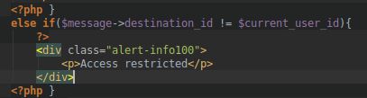

# Projet " STI" Part 2

Authors: Koubaa Walid & Schar Joel
Date: 15/01/2019

## Introduction au site web

#### Crepe Messaging, c'est quoi ?

Une crêpe est un support comestible qui peut être remis en le lançant comme un freezbe. Crepe Messaging vous permet d'envoyer de messages qui utilisent ce support à tous les utilisateurs inscrits sur la plateforme.

Par manque de temps pour le développement nous ne sommes pas parvenu à rendre la plateforme plus illustrative.

#### Le fonctionnement

Il existe sur la plateforme deux type d'utilisateurs. 

- Des utilisateurs standard qui obtienne un compte, soit en s'inscrivant au moyen du formulaire prévu à cet effet, soit si un administrateur leur crée un accès.
- Des administrateurs qui ont en plus la possibilité de modifier le profile des autres utilisateurs.

Autant les utilisateurs que les administrateurs ont l'accès à la fonctionnalité principale de CrepMessaging qui est l'envoie et la réception de Crêpes Postales.

## Description du système

#### Data-flow diagrams 

Voici ci dessous le diagramme représentant la décomposition du système.

Celui ci représente les processus, les flow et le **périmètre de sécurisation** indiquant les niveaux de sécurité du système est représenté par les pointillés rouge.

#### Objectifs du système

Permettre d'envoyer des messages entre collaborateurs et permettre aux administrateur de creer de nouveaux utilisateur en lui spécifiant un role (collaborateur/administrateur).

#### Hypothèses de sécurité

Nous supposons que dans notre système:

- seul un administrateur peut creer de nouveau utilisateur
- les messages ne peuvent etre lu que par l'utilisateur qui l'a rédigé

#### Exigences de sécurité

- Un utilisateur doit pouvoir acceder qu'a ses propres messages et non ceux des autres.
- Seul un administrateur peut creer un nouvel utilisateur
- Un utilisateur ne peut pas changer de role et devenir administrateur (escalade de privilège)
- Le site Web doit être disponible à 99% du temps (disponibilité)

#### Biens
Les **biens** que nous pouvons récuperer sont:

- la liste des utilisateurs (Base de donnée des utilisateurs)
- leurs mots de passe
- les contenus des messages envoyés 

#### Périmètre de sécurisatiom
Le périmètre de sécurisation indiquant les niveaux de sécurité du système est représenté par les pointillés rouge sur le DFD plus haut.

## Sources de menaces

Sur un système de messagerie comme celui de "CrepMessaging" il existe plusieurs point de menace qu'un utilisateur pourrait vouloir exploiter. 

Dans notre cas l'accès à l’application est libre du fait que la création d'un compte est libre. En effet, dès la création d'un nouveau compte au moyen du formulaire d'inscription, le nouvel utilisateur obtient automatiquement l'accès complet à l'application au même titre que les autres utilisateur. Il à ensuite la possibilité d'envoyer et de recevoir des Crêpes Postales.

Sur cette plateforme on peut envisager les potentielles menaces suivantes.

1. Un utilisateur normal qui voudrait voir les messages des autres utilisateurs.
2. Un utilisateur normal qui voudrait envoyer des messages en se faisant passer pour un autre utilisateur.
3. Un utilisateur qui voudrait supprimer les messages d'un autre utilisateur.
4. Un utilisateur qui voudrait modifier le message d'un autre utilisateur.
5. Un utilisateur qui voudrait faire passer son compte en administrateur.
6. Un utilisateur qui voudrait modifier le mot de passe d'un autre compte.
7. Un utilisateur qui voudrait obtenir les mots de passe des autres comptes de la plateforme.

Les menaces citées ci-dessus représentes les différentes actions qu'un attaquant pourrait vouloir faire afin de détourner l'utilisation normale de l'application dans le bute d'obtenir de l'information à la-quel il ne devrait pas avoir accès ou bien de se servir de la plateforme pour usurper une identité.

## Scenario d'attaques

Afin d'atteindre l'un des buts potentiel d'un attaquant. A savoir l'une des menaces listée plus haut, un attaquant va se servir d'un scénario d'attaque. Ces scénario d'attaque vont permettre d'exploiter ou de contourner une faille dans le code source de l'application.

Chaque scénario d'attaque sera testé sur l'application et une proposition de correction du problème sera  dans la partie "Contre mesures".

###A1 - Attaque avec modification de l'URL.

Elément du système attaqué: Page de login

Motivation: L'objectif est de pouvoir se connecter automatiquement depuis l'URL via un POST

Scénario: Nous avons essayé de nous connecter directement à la manière d'un POST en spécifiant les credentials directement depuis URL.

Bilan de l'attaque: FAILURE !

###A2 - Injection SQL depuis le formulaire (form)

####Elément du système attaqué: Page de login

####Motivation:
L'objectif est de pouvoir bypasser la connexion en injectant une requete SQL dans le formulaire de la page de login

####Scénario:

On injecte dans l'input de l'username la requête SQL: 

'1 admin 1=1''

####Bilan de l'attaque: SUCCESS !

Réussit par Joel en injectant dans l'input de l'username la requete SQL: '1 

admin 1=1''

###A3 -Brute forcable login form - No limit of max login attempts

Element du système attaqué: le formulaire de login (username et password)

Motivation: L'objectif est de bruteforcer tout les mots de passe pour tout les logins que nous spécifions dans la liste de payloads via l'outil Burp Suite.
		
####Scénario d'attaque: 

 Avec Burp on configure le proxy de notre browser Firefox et spécifie l'adresse et le port de notre login Crepe Messaging (127.0.0.1:8080).
Ensuite une fois les configurations terminées, on appuie on teste  

Grace à cela nous pouvons brute forcer tout les mots de passe pour tout les logins que nous spécifions dans la liste de payloads. Pour faciliter la chose et rendre le processus automatisé on peut choisir une liste de mot de passe parmi celle proposées par Burp ou bien choisir un fichier de mot de passe (rockyou.txt par exemple).

-> le plus interessant est que nous pouvons choisir des options qui permettront de découvrir quels sont les username existant en fonction du message d'erreur retourné par une mauvaise saisie de credentials.
(si on détecte dans la page le message d'erreur password incorrect, cela veut dire que l'username saisi existe dans la DB).

Ainsi en fonction de ce message on peux orienter notre attaque sur le username visé et tester pour celui ci tout les mot de passes a notre disposition. Une fois le login "success", nous avons la bonne combinaison username/password.

Bilan de l'attaque: SUCCESS !

Au final nous réussissons à nous connecter avec les bons credentials.

### A4 - Id des messages directement accessibles depuis l'URL

#### Element du système attaqué: 
Transmission des paramètres par l'url.
Il n'y pas de validation du droit d'accès au message côté client.

#### Motivation:
Permet l'accès aux messages qui ne nous sont pas destinés.

-> on peut lire les messages de tout le monde
Il suffit de se loguer avec n'importe quel utilisateur et ensuite on peut 
avoir accès aux messages de tout le monde.

ex: *http://localhost:8080/mail.php?viewMail&id=32*

on peut aussi les supprimer
Une fois connecté avec un utilisateur

1. On envoie un mail a l'administrateur

	

2. On arrive a lire les messages de l'administrateur (sachant que les mails ont un id définit à partir d'un compteur qui s'incremente on peut deviner facilement son id) et on peu même les supprimer.
Par contre il faut connaitre l'id du message mais vu que ceux ci s' incrémentent on peux les deviner 

	

#### Bilan de l'attaque: SUCCESS !

###A5 Acces aux informations des utilisateur visibles seulement par l'administrateur

Element du système attaqué: le formulaire de login (username et password)

####Motivation:

Permet l'accès aux messages qui ne nous sont pas destinés.

####Scenario d'attaque:

Récuperer http://localhost:8080/admin.php?user_id=7

####Bilan de l'attaque: FAILURE !

## Menaces

 -> Pas de nombre de login max bloquant l'accès au compte au bout de 3 essais pour une durée limitée
 
## Contre mesures

Voici ci dessus les contre-mesures que nous avons appliqués pour palier au problèmes exploités dans la partie Scénarios d'attaques.

1. **Attaque 4** Faire en sorte que les messages ne soit pas incrementés mais que leur id soit hasher avec une fonction de hashage (meme avec md5) afin qu'ils ne soient pas prédictibles.

   **Solution :** (hasher les id des messages dans le code php)

2. Restreindre l'accès à la pages du message uniquement si l'utilisateur connecté est le destinataire du message.

 	**Solution :**  On va tester quel'utilisateur connecté soit bien le destinataire du message qu'il veut consulter.
   
   

3. **Attaque 3 et 4**

	 **Contre mesure:** Limiter le nombre d'essais consécutifs durant une période et bloquer des nouvelles tentatives pendant un certain laps de temps (30 min)

 **Solution :** avec un timeout dans le code php au bout de 3 essais.

4. Définir une politique de mot de passe plus restrictive et severe

